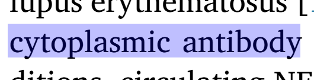

# Easy Paper Finder 🐢

Easy Paper Finder is an open source extension used to make easier for researchers and scientists to find references in PDF file directly on the browser.

## How to use ✨

When you open your PDF file it will be shown this way:

When you select a reference[1] with your mouse you can click on "Find paper" to find the reference inside the paper.

You can select words and topics present on the paper and click "Search Online" to find other papers related to the topic selected.

For example: If you select "Inflammatory response" will be shown to you papers related to this topic, like this one "https://www.sciencedirect.com/science/article/abs/pii/S1521689603001162".

[1]This reference can be names like "John et al." or numbers "[1]" :

## Technical details

This extension was built on top of a Mozilla extension PDF.js.
https://mozilla.github.io/pdf.js/
